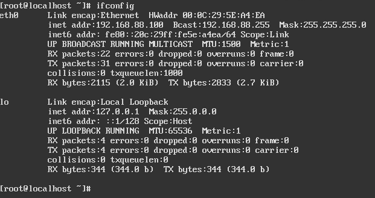
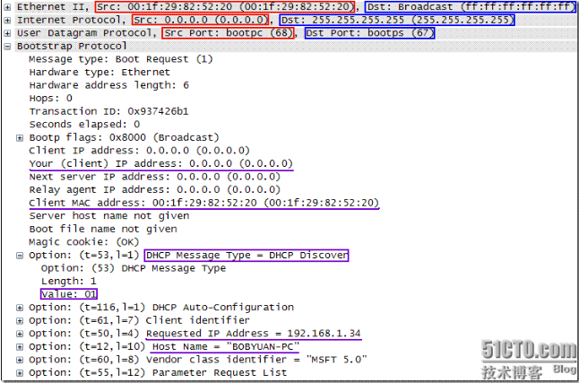
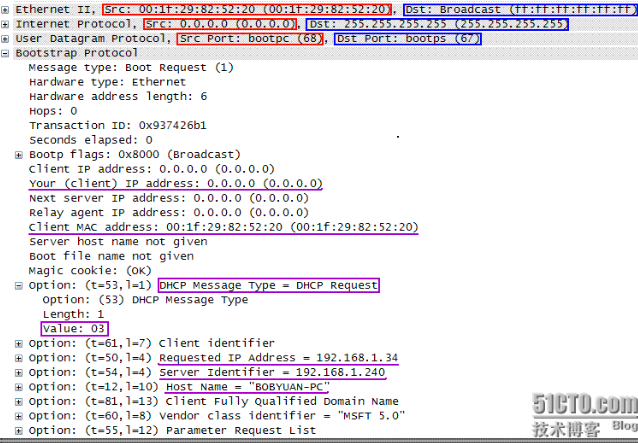
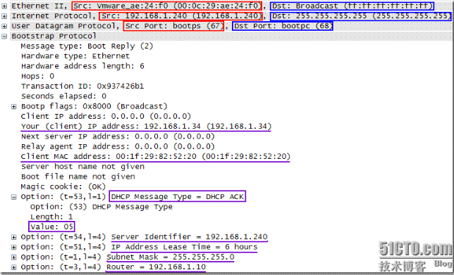
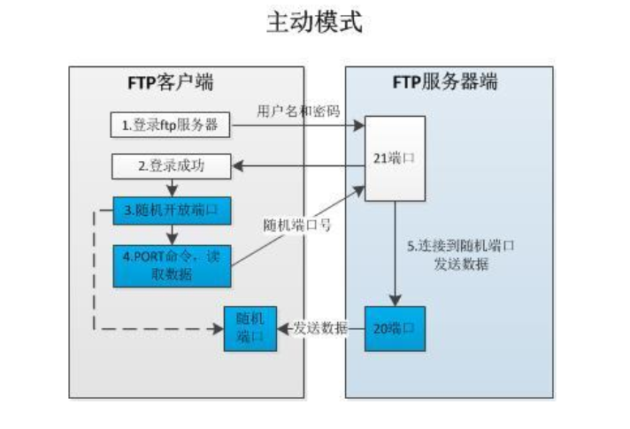
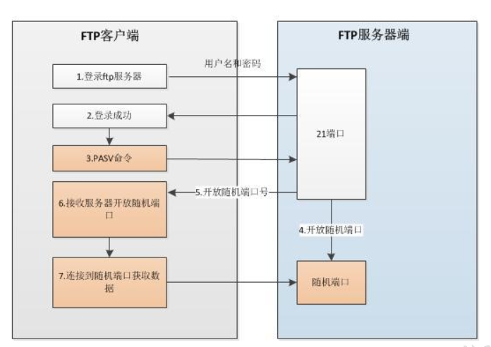

## DHCP服务

### DHCP租约

DHCP租约图解

DHCPserver日志与DHCP客户机IP信息

DHCP租约过程分为4步：

> 来源：[图解DHCP的4步租约过程](https://www.cnblogs.com/tlnshuju/p/7356311.html)

- 客户机请求IP（客户机发DHCPDISCOVER广播包）

  > 第1步：客户机请求IP
  >
  > ==客户机请求IP也称为DHCPDISCOVER==。
  >
  > 当一个DHCP客户机启动时，会自己主动将自己的IP地址配置成==0.0.0.0==。因为使用0.0.0.0不能进行正常通信，所以客户机就必须通过DHCPserver来获取一个合法的地址。因为客户机不知道DHCPserver的IP地址，所以它使用==0.0.0.0==的地址作为源地址，使用==UDP68port==作为源port，使用==255.255.255.255==作为目标地址，使用==UDP67port==作为目的port来广播请求IP地址信息。广播信息中包括了DHCP客户机的MAC地址和计算机名，以便使DHCPserver能确定是哪个客户机发送的请求。
  >
  >  
  >
  > DHCP客户机总是试图又一次租用它接收过的最后一个IP地址，这给网络带来一定的稳定性。
  >
  > 

- 服务器响应（服务器发DHCPOFFER广播包）

> 第2步：server响应
>
> ==server响应也称为DHCPOFFER==
>
> 当DHCPserver接收到客户机请求IP地址的信息时，它就在自己的IP地址池中查找是否有合法的IP地址提供给客户机。假设有。DHCPserver就将此IP地址做上标记。增加到DHCPOFFER的消息中，然后DHCPserver就广播一则包含下列信息的DHCPOFFER消息：
>
> DHCP客户机的MAC地址；DHCPserver提供的合法IP地址；子网掩码；默认网关（路由）；租约的期限。DHCPserver的IP地址。
>
>  
>
> 由于DHCP客户机还没有IP地址，所以DHCPserver使用==自己的IP地址==作为源地址，使用==UDP67port==作为源port，使用==255.255.255.255==作为目标地址。使用==UDP68port==作为目的port来广播DHCPOFFER信息
>
> 

- 客户机选择IP（客户机发DHCPREQUEST广播包）

> 第3步：客户机选择IP
>
> ==客户机选择IP，也称为DHCPREQUEST==
>
> DHCP客户机从接收到的第一个DHCPOFFER消息中选择IP地址。发出IP地址的DHCPserver将该地址保留。这样该地址就不能提供给还有一个DHCP客户机。当客户机从第一个DHCPserver接收DHCPOFFER并选择IP地址后，DHCP租约的第三过程发生。客户机将DHCPREQUEST消息广播到全部的DHCPserver，表明它接受提供的内容。DHCPREQUEST消息包含为该客户机提供IP配置的server的服务标识符（IP地址）。DHCPserver查看server标识符字段。以确定它自己是否被选择为指定的客户机提供IP地址，假设那些DHCPOFFER被拒绝。则DHCPserver会取消提供并保留其IP地址以用于下一个IP租约请求。
>
>  
>
> 在客户机选择IP的过程中。尽管客户机选择了IP地址，可是还没有配置IP地址。而在一个网络中可能有几个DHCPserver，所以==客户机仍然使用0.0.0.0的地址作为源地址，使用UDP68port作为源port。使用255.255.255.255作为目标地址。使用UDP67port作为目的port来广播DHCPREQUEST信息==
>
> 

- 服务器确定租约（服务器发DHCPACK/DHCPNAK广播包）

> 第4步：server确认租约
>
> ==server确认租约，也称为DHCPACK/DHCPNAK==
>
> DHCPserver接收到DHCPREQUEST消息后。以DHCPACK消息的形式向客户机广播成功的确认，该消息包括有IP地址的有效租约和其它可能配置的信息。尽管server确认了客户机的租约请求，可是客户机还没有收到server的DHCPACK消息，所以==server仍然使用自己的IP地址作为源地址。使用UDP67port作为源port，使用255.255.255.255作为目标地址。使用UDP68port作为目的port来广播DHCPACK信息==。当客户机收到DHCPACK消息时，它就配置了IP地址。完毕了TCP/IP的初始化。
>
>  
>
> 假设DHCPREQUEST不成功。比如客户机试图租约先前的IP地址，但该IP地址不再可用。或者由于客户机移到其它子网，该IP无效时，DHCPserver将广播否定确认消息==DHCPNAK==。当客户机接收到不成功的确认时，它将又一次開始DHCP租约过程。

### 租用失败

假设DHCP客户机无法找到DHCPserver，它将从TCP/IP的B类网段==169.254.0.0==中挑选一个IP地址作为自己的IP地址，继续==每隔5分钟尝试==与DHCPserver进行通讯，一旦与DHCPserver取得联系。则客户机放弃自己主动配置的IP地址，而使用DHCPserver分配的IP地址。

DHCP客户机收到DHCP服务器回应的ACK报文后，通过地址冲突检测==（arp）==发现服务器分配的地址冲突或者由于其他原因导致不能使用，则发送==DECLINE==报文，通知服务器所分配的IP地址不可用

假设一台DHCP客户机有两个或者多个网卡，则DHCPserver会为每一个网卡分配一个唯一而有效的IP地址。

### DHCP续租

## FTP服务

### 主动模式

### 被动模式

