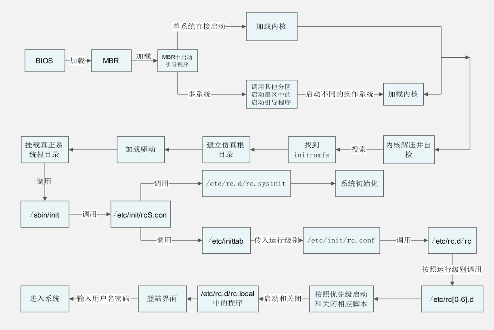
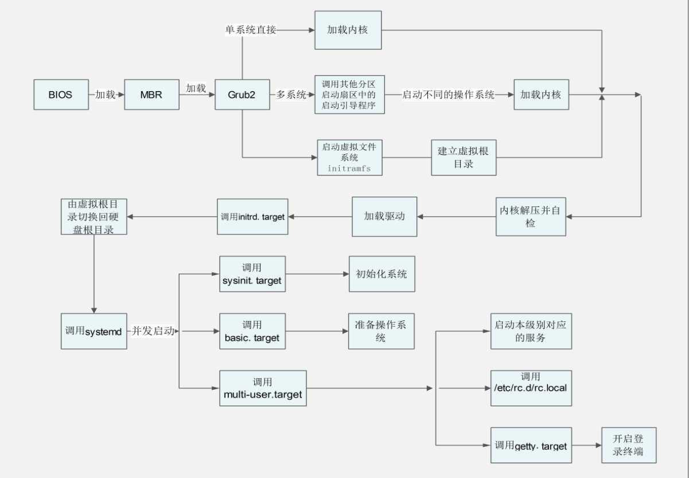

# CentOS6与CentOS7启动流程

CentOS6和7在启动后期不一样，CentOS6后期是init，CentOS7是systemd

## CentOS 6.x基本启动过程

### 1.1 post加电自检

服务器加电，加载BIOS信息，BIOS进行系统检测

### 2.2 MBR引导

自检硬件没有问题时候，这里以BIOS为例，BIOS将会直接去找硬盘的第一个扇区，找到前446字节，将MBR加载到内存中，MBR将告诉程序下一阶段去哪里找系统grub引导。此阶段属于grub的第一阶段。grub还有1.5阶段和2阶段。

```
MBR：Master Boot Record
512bytes：
    446bytes：bootloader
    64bytes：fat 
    2bytes：55AA 
```


### 2.3 GRUB引导

GRUB的主要作用是提供一个菜单，允许用户选择要启动系统或不同的内核版本，把用户选定的内核装载到内存的特定空间中，解压展开，并把系统控制权移交给内核，一台主机上可能装有不止一个操作系统，用户可以根据GRUB提供的启动菜单选定操作系统，随即加载指定内核.。

grub第1.5和2阶段，信息默认存放在扇区中,如果使用grub-install生成的2阶段的文件是存放在/boot分区中的。 
为了加载内核系统，不得不加载/boot分区，而加载/boot分区，需要有/boot分区的驱动，/boot分区驱动是放在/boot分区中的,啊，我们好像进入了死循环了，Linux是怎么解决的呢？就是靠放在1.5阶段中的数据，是放在第一个扇区后的后续扇区中，具体占用多少字节，不太清楚，只知道1.5阶段和2阶段总共27个扇区。

stage1.5：

mbr之后的扇区，识别stage2所在的分区上的文件系统

stage2：

开机启动的时候看到的Grub选项、信息，还有修改GRUB背景等功能都是stage2提供的，stage2会去读入/boot/grub/grub.conf或者menu.lst等配置文件

 

### 2.4 读取grub.conf文件

读取grub.conf文件以确定内核启动的参数，准备启动内核

 

### 2.5 启动内核

加载内核，核心开始解压缩，启动一些最核心的程序。 
因为为了让内核足够轻小，硬件驱动并没有放在内核文件里面，我们可以看到内核很小,才4M左右，我们可以想象Windows中的驱动，安装系统时候还需要使用驱动软件下载好长时间呢 
因此需要使用`/boot/initramfs-2.6.32-696.el6.x86_64.img`来驱动硬件

```bash
[root@CentOS6 ~]# ll -h /boot/vmlinuz-2.6.32-696.el6.x86_64

-r-xr-xr-x. 1 root root 4.1M Jul  8 21:06 /boot/vmlinuz-2.6.32-696.el6.x86_64
```

 

### 2.6 加载伪文件系统（ramdisk）

内核已将启动起来了，再调用ramdisk文件，尝试驱动所有的硬件设备，到这一步，内核起来了，所有驱动也装上了，因此后面的启动就可以交给程序了。

 

### 2.7 启动init进程

grub中默认指定init=/sbin/init程序，可以在grub.conf中kernel行自定义执行程序init=/bin/bash,此时可以绕过下面步骤直接进入bash界面。 
内核源代码文件中显示996行左右，规定了init启动的顺序，/sbin/init->/etc/init->/bin/init->/bin/sh,/bin/bash没有写，应该是和/bin/sh一样吧

 

 

**(1) 读取/etc/inittab文件**

inittab文件里面定义了系统默认运行级别，这一步做了一些工作如下：

```bash
 a)初始运行级别(RUN LEVEL)

 b)系统初始化脚本

 c)对应运行级别的脚本目录

 d)定义UPS电源终端/恢复脚本

 e)在虚拟控制台生成getty,以生成终端

 f)在运行级别5初始化X
```

 

**(2)执行/etc/rc.d/rc.sysinit程序**

系统初始化一些脚本，主要完成以下工作

 

```bash
a)设置主机名

b)设置欢迎信息

c)激活udev和selinux可以在grub.conf中,kernel行添加selinux=0以关闭selinux

d)挂载/etc/fstab文件中定义的文件系统

e)检测根文件系统，并以读写方式重新挂载根文件系统

f)设置系统时钟

g)激活swap设备

h)根据/etc/sysctl.conf文件设置内核参数

i)激活lvm及software raid设备

j)加载额外设备的驱动程序

k)清理操作
```

 

**(3)/etc/rc#.d/文件（各种服务）**

里面定义的是各种服务的启动脚本，可以ls查看，S开头代表开机启动的服务，K开头的是关机要执行的任务。#代表数字，一个数字代表一个运行级别，共7个运行级别，这里就不多说了。

 

**(4) /etc/rc.d/rc.local文件**

这里面可以自定义开机启动的命令。

 

### 2.8 执行/bin/login

执行/bin/login程序，等待用户登录




## CentOS7启动流程
CentOS7和CentOS6启动流程差不多，只不过到init程序时候，改为了systemd，因此详细解释一下systemd后的启动流程

### 1.1  uefi或BIOS初始化，开始post开机自检

### 2.1  加载mbr到内存

### 3.1  GRUB阶段

### 4.1  加载内核和inintamfs模块

### 5.1  内核开始初始化，使用systemd来代替centos6以前的init程序

(1) 执行initrd.target
包括挂载/etc/fstab文件中的系统,此时挂载后，就可以切换到根目录了

(2) 从initramfs根文件系统切换到磁盘根目录

(3) systemd执行默认target配置
centos7表面是有“运行级别”这个概念，实际上是为了兼容以前的系统，每个所谓的“运行级别”都有对应的软连接指向，默认的启动级别时/etc/systemd/system/default.target,根据它的指向可以找到系统要进入哪个模式

模式：

0 ==> runlevel0.target, poweroff.target
1 ==> runlevel1.target, rescue.target
2 ==> runlevel2.target, multi-user.target
3 ==> runlevel3.target, multi-user.target
4 ==> runlevel4.target, multi-user.target
5 ==> runlevel5.target, graphical.target
6 ==> runlevel6.target, reboot.target

(4)systemd执行sysinit.target
有没有很眼熟？是的，在CentOS6上是被叫做rc.sysint程序，初始化系统及basic.target准备操作系统

(5)systemd启动multi-user.target下的本机与服务器服务

(6)systemd执行multi-user.target下的/etc/rc.d/rc.local文件，执行文件中的命令

### 6.1  Systemd执行multi-user.target下的getty.target及登录服务

getty.target我们也眼熟，它是启动终端的systemd对象。如果到此步骤，系统没有被指定启动图形桌面，到此就可以结束了，如果要启动图形界面，需要在此基础上启动桌面程序

### 7.1  Systemd执行graphical需要的服务

CentOS6，7启动区别：

​	Centos6是线性启动的， 而7在systemd中是瀑布流形式启动的，所以开机会快一点

​	系统启动和服务器守护进程管理器，它不同于centos5的Sysv init，centos6的Upstart（Ubuntu制作出来），systemd是由Redhat的一个员工首先提出来的，它在内核启动后，服务什么的全都被systemd接管，kernel只是用来管理硬件资源，相当于内核被架空了，因此linus很不满意Redhat这种做法。

Sysv init运行程序顺序：





